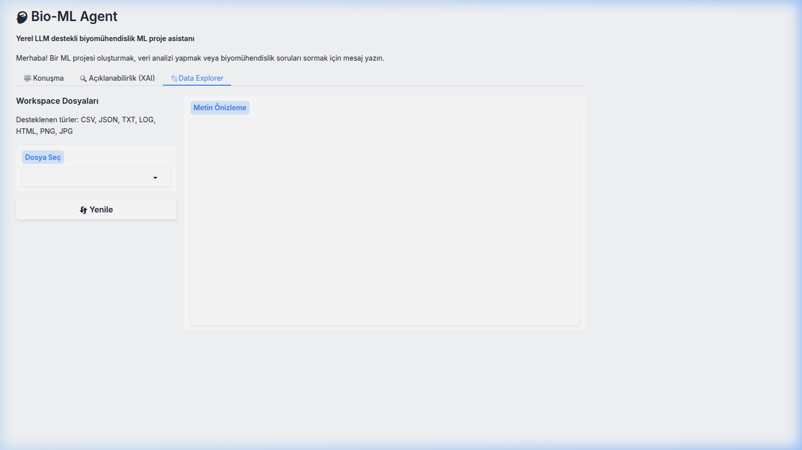

<div align="center">

# 🧠 Bio-ML Agent

**Modular AI assistant for bioengineering and ML workflows**

[](https://www.python.org/downloads/)
[](LICENSE)
[](#-desteklenen-llm-backendleri)
[](#-docker-ile-çalıştırma)

</div>

---

## 🎯 Ne Yapar?

Doğal dil komutuyla **3 uzman ajan** koordineli çalışarak komple ML projesi oluşturur:

```
>>> Buradaki data/raw/diabetes.csv verisini oku, temizle, model kur ve SHAP analizi yap.
```

**→ Veri Mühendisi** temizler → **ML Uzmanı** eğitir + SHAP üretir → **Biyoinformatik Uzman** klinik yorumlar

---

## ⚡ Kurulum ve Çalıştırma

```bash
# 1. Klonla
git clone https://github.com/zedraxa/bio-ml-agent_v0.2.git && cd bio-ml-agent_v0.2

# 2. Sanal ortam kur
python3 -m venv venv && source venv/bin/activate

# 3. Bağımlılıkları yükle
pip install -e ".[all]"

# 4. API Key ayarla
export GEMINI_API_KEY="YOUR_KEY"

# 5. Web arayüzünü başlat
python3 web_ui.py
# → Tarayıcıda http://localhost:7860
```

### 🐳 Docker ile Çalıştırma

```bash
docker-compose up -d
# API Server:  http://localhost:8001
# Web UI:      http://localhost:7860
# MLflow:      http://localhost:5005
```

---

## 🏗️ Mimari


---

## 🛠️ Özellikler ve Kullanım

### 1. 💬 Konuşma Arayüzü (Chat) & Otonom Gezinme

Web UI üzerinden doğal dilde ML projeleri oluşturabilir, ajanın internette **kendi kendine gezinerek** medikal / teknik veri araştırmasını sağlayabilirsiniz. (Sürüm 7.0 Otonom Browser Sub-Agent)


**Kullanım adımları:**
1. `python3 web_ui.py` ile arayüzü başlatın
2. Sağ panelden **Model** seçin (örn: `gemini-2.5-flash`)
3. Alt kısımdaki mesaj kutusuna isteğinizi yazın
4. **"Gönder 🚀"** butonuna tıklayın
5. Agent otonom olarak veri yükler, model eğitir, rapor yazar

**Örnek istek:**
```
Breast cancer veri setini kullanarak sınıflandırma modeli oluştur.
En az 5 model karşılaştır ve en iyi modeli seç.
```

---

### 2. 🔍 Açıklanabilir Yapay Zeka (XAI)

Model eğitiminden sonra SHAP grafikleri otomatik üretilir ve XAI sekmesinde görüntülenir.


**Kullanım adımları:**
1. Konuşma sekmesinden bir ML analiz isteği gönderin
2. Agent modeli eğitip SHAP analizi tamamladıktan sonra **"Açıklanabilirlik (XAI)"** sekmesine geçin
3. **"XAI Grafikleri Yenile"** butonuna tıklayın
4. SHAP Özellik Önemi ve Etkileşim grafikleri yüklenir

**Üretilen grafikler:**
- SHAP Summary Plot — hangi özellik modelin kararını ne kadar etkiliyor?
- SHAP Feature Interaction — özellikler arası ilişki haritası

---

### 3. 📊 Data Explorer

Workspace'deki CSV dosyalarını, JSON sonuçlarını ve Plotly grafiklerini tarayıcıdan doğrudan inceleyin.



**Kullanım adımları:**
1. **"Data Explorer"** sekmesine geçin
2. Sol panelden **"Dosya Seç"** dropdown'ından bir dosya seçin
3. **"Yenile"** butonuyla dosya listesini güncelleyin
4. Sağdaki **"Metin Önizleme"** panelinde dosya içeriğini görüntüleyin

---

### 4. 🔄 Sürekli Öğrenme (Active Learning)

Yeni sensör verileri geldikçe model arka planda kendini yeniden eğitir.

**Terminal'de çalıştırma:**
```bash
# Active Learning demo (Redis'e sahte IoT verisi bas + otomatik retrain izle)
python scripts/demos/active_learning_demo.py
```

**Çıktı:**
```
🚀 BIO-ML AGENT: ACTIVE LEARNING & STREAMING DEMO
💉 Sensör Simülasyonu Başladı: Her saniye 1 yeni hasta verisi akıyor...
🔄 Active Learning Tetiklendi! Gelen yeni vaka sayısı: 5
🤖 Yeni veriyle modeller eğitiliyor...
🏆 En İyi Model: RandomForest (accuracy: 0.7935)
✅ Demo senaryosu tamamlandı.
```

---

### 5. 🐳 Kurumsal Altyapı (Docker)

5 mikroservis Docker Compose ile yönetilir:

| Servis | Port | Açıklama |
|--------|------|----------|
| `redis` | 6380 | Task Queue + Streams |
| `api` | 8001 | REST API + Webhook |
| `worker` | — | Arkaplan görev işçisi |
| `web_ui` | 7860 | Gradio arayüzü |
| `mlflow` | 5005 | MLflow Tracking |

**Webhook kullanımı:**
```bash
curl -X POST http://localhost:8001/api/v1/webhook/clinical_data \
  -H "Content-Type: application/json" \
  -d '{"data": {"patient_id": "999", "glucose": 140}}'
```

---

## 🤖 Desteklenen LLM Backend'leri

| Backend | Komut |
|---------|-------|
| **Google Gemini** | `--model gemini-2.5-flash` |
| **Ollama** (Yerel) | `--model qwen2.5:7b-instruct --backend local` |
| **OpenAI** | `--model gpt-4o --backend remote` |
| **Anthropic** | `--model claude-3-5-sonnet --backend remote` |

---

## 📁 Proje Yapısı

```
bio-ml-agent/
├── agent.py                      # Ana agent motoru
├── web_ui.py                     # Gradio Web UI
├── api_server.py                 # FastAPI REST + Webhook
├── docker-compose.yml            # 5 Mikroservis
├── swarm/                        # Çoklu Ajan (Orchestrator + 3 Expert)
├── data_streams/                 # DB Connector + Redis Streams
├── utils/                        # Model karşılaştırma, config, görselleştirme
├── tests/                        # Test suite
└── workspace/                    # Agent çıktıları
```

---

## 📄 Dokümantasyon

| Dosya | İçerik |
|-------|--------|
| [Kullanma Kılavuzu](KULLANMA_KILAVUZU.md) | Detaylı kullanım rehberi (20 bölüm) |
| [Proje Raporu](RAPOR.md) | Kapsamlı teknik rapor |
| [Geliştirme Planı](GELISTIRME_PLANI.md) | Sprint bazlı yol haritası |
| [Katkı Rehberi](CONTRIBUTING.md) | Geliştirici katılım kılavuzu |

---

## ⚠️ Güvenlik

> **Uyarı:** Plugin sistemi yerel Python kodu çalıştırır. Güvenilmeyen plugin'leri yüklemeyin.
> Bash komutları denylist ile filtrelenir, path traversal koruması aktiftir.

---

## 👤 Geliştirici

**Yusuf Kavak** — [@zedraxa](https://github.com/zedraxa)

---

<div align="center">

**⭐ Bu projeyi beğendiyseniz yıldız vermeyi unutmayın!**

</div>
