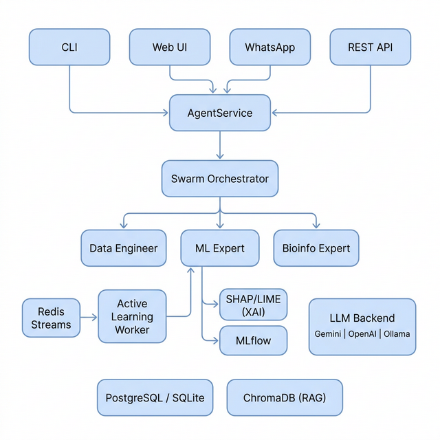
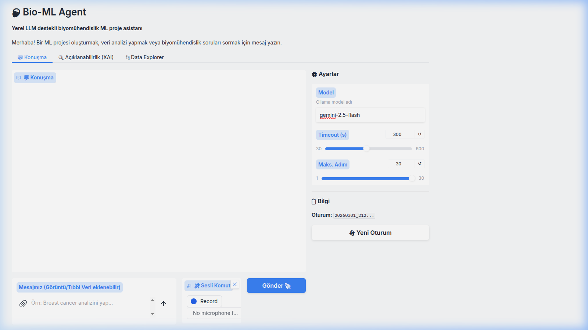
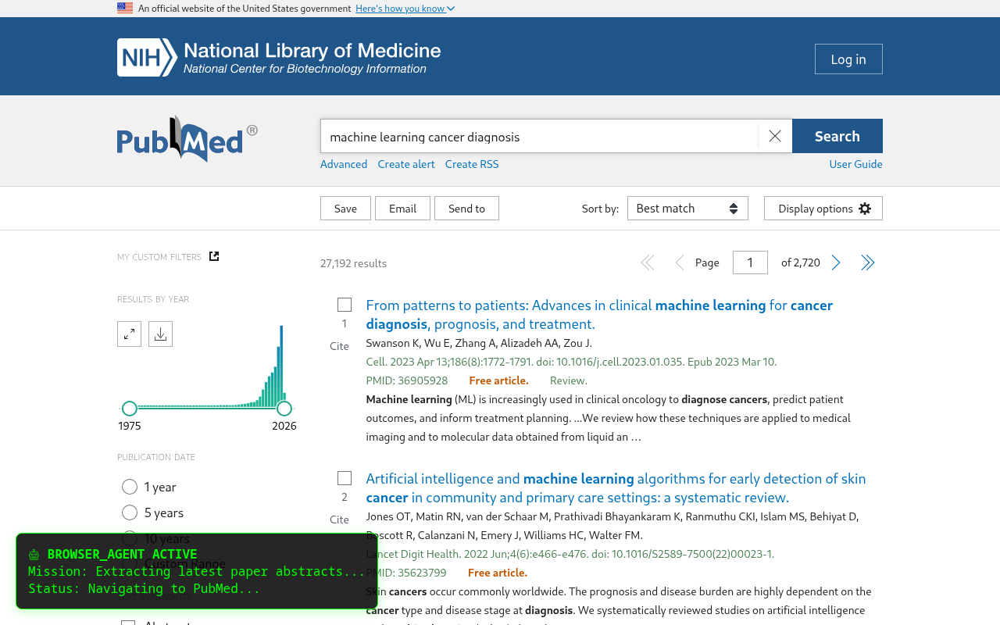
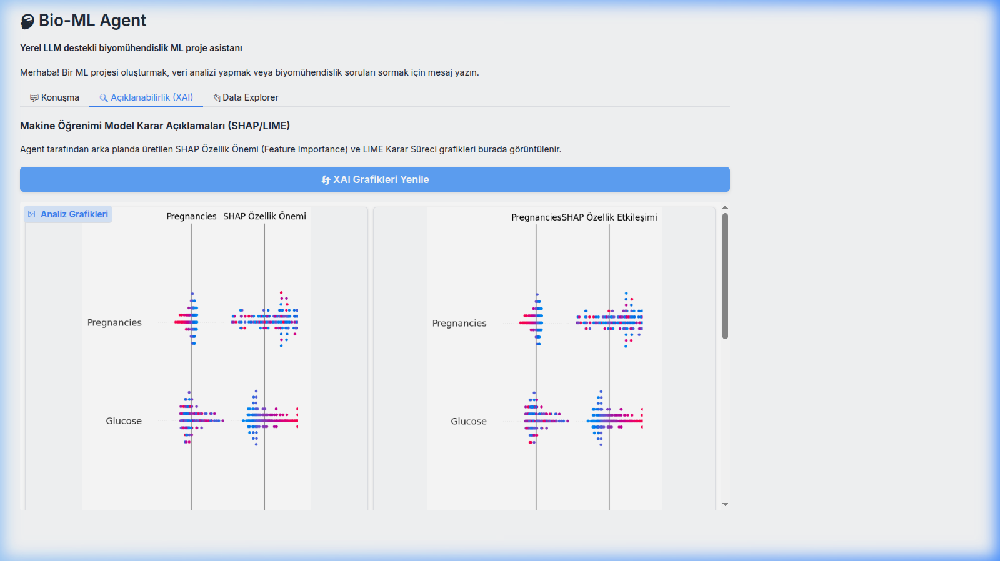

<div align="center">

# 🧠 Bio-ML Agent

**Modular AI assistant for bioengineering and ML workflows**

[](https://www.python.org/downloads/)
[](LICENSE)
[](#-desteklenen-llm-backendleri)
[](#-docker-ile-çalıştırma)

</div>

---

## 🎯 Ne Yapar?

Doğal dil komutuyla **3 uzman ajan** koordineli çalışarak komple ML projesi oluşturur:

```
>>> Buradaki data/raw/diabetes.csv verisini oku, temizle, model kur ve SHAP analizi yap.
```

**→ Veri Mühendisi** temizler → **ML Uzmanı** eğitir + SHAP üretir → **Biyoinformatik Uzman** klinik yorumlar

---

## ⚡ Kurulum ve Çalıştırma

```bash
# 1. Klonla
git clone https://github.com/zedraxa/bio-ml-agent_v0.2.git && cd bio-ml-agent_v0.2

# 2. Sanal ortam kur
python3 -m venv venv && source venv/bin/activate

# 3. Bağımlılıkları yükle
pip install -e ".[all]"

# 4. API Key ayarla
export GEMINI_API_KEY="YOUR_KEY"

# 5. Web arayüzünü başlat
python3 web_ui.py
# → Tarayıcıda http://localhost:7860
```

### 🐳 Docker ile Çalıştırma

```bash
docker-compose up -d
# API Server:  http://localhost:8001
# Web UI:      http://localhost:7860
# MLflow:      http://localhost:5005
```

---

## 🏗️ Mimari (Ultra Agent v1.0)
Sistem, Antigravity standartlarında tamamen otonom ve kalıcı hafızalı bir Ultra Ajan mimarisine yükseltilmiştir:
- **Orkestrasyon:** LangGraph (State Control, Plan-Execute-Verify) ve Temporal (Durable Execution)
- **Hafıza & RAG:** Qdrant (Agentic Memory, Provenance, TTL, Hybrid Search)
- **Ajan Yönetimi:** LiteLLM Proxy (Maliyet İzleme, Model Routing, Coğrafi Veri Egemenliği)
- **Tarayıcı Hakimiyeti:** Playwright / Browser-Use tabanlı izole tenant profilleri
- **Gözlemlenebilirlik:** OpenTelemetry & Prometheus tabanlı metrikler ve Audit Trail (Log İzleri)



---

## 🛠️ Özellikler ve Kullanım

### 1. 💬 Konuşma Arayüzü (Chat) & Otonom Gezinme

Web UI üzerinden doğal dilde ML projeleri oluşturabilir, ajanın internette **kendi kendine gezinerek** medikal / teknik veri araştırmasını sağlayabilirsiniz. (Sürüm 1.0 Otonom Browser Sub-Agent)




**Kullanım adımları:**
1. `python3 web_ui.py` ile arayüzü başlatın
2. Sağ panelden **Model** seçin (örn: `gemini-2.5-flash`)
3. Alt kısımdaki mesaj kutusuna isteğinizi yazın
4. **"Gönder 🚀"** butonuna tıklayın
5. Agent otonom olarak Temporal üzerinde workflow başlatıp sonucu raporlar

---

### 2. 🔐 Otonom Hesap ve API Yönetimi (HITL Korumalı)
Ajan artık dış sitelerden veri çekmek veya API anahtarı almak için kendi adına **geçici veya kalıcı e-posta kutuları** (Mail.tm) açabilir.

- Web sitelerine kendi kendine (`dom_driver.py`) kayıt formunu doldurur.
- Kritik "API Kayıt", "Hesap Oluşturma" veya "Dosya Silme" operasyonlarında **Human-in-the-Loop (HITL)** devreye girer. İşlem yapmadan sizden onay ister.
- Kazandığı API anahtarlarını, şifrelerini ve mail adreslerini şifreli Kasasında (`utils/vault.py` - Fernet Encrypted) saklar.

---

### 3. 🔍 Açıklanabilir Yapay Zeka (XAI)

Model eğitiminden sonra SHAP grafikleri otomatik üretilir ve XAI sekmesinde görüntülenir.



**Kullanım adımları:**
1. Konuşma sekmesinden bir ML analiz isteği gönderin
2. Agent modeli eğitip SHAP analizi tamamladıktan sonra **"Açıklanabilirlik (XAI)"** sekmesine geçin
3. **"XAI Grafikleri Yenile"** butonuna tıklayın
4. SHAP Özellik Önemi ve Etkileşim grafikleri yüklenir

**Üretilen grafikler:**
- SHAP Summary Plot — hangi özellik modelin kararını ne kadar etkiliyor?
- SHAP Feature Interaction — özellikler arası ilişki haritası

---

### 4. 🧠 Gelişmiş Hafıza (Qdrant tabanlı RAG)

Ajan, konuşulan her bağlamı Qdrant vektör veritabanında saklar.
- Her veri için "Provenance" (Hangi dosyadan geldiği) kaydını tutar.
- TTL (Yaşam süresi) kuralı çalıştırarak verileri otomatik temizleyebilir.

---

### 5. 🐳 Kurumsal Altyapı (Docker)

7 mikroservis Docker Compose ile yönetilir ve sıkılaştırılmıştır (Seccomp, No-New-Privileges):

| Servis | Port | Açıklama |
|--------|------|----------|
| `redis` | 6380 | Temporal/RQ arayüzü için geçici stream/cache |
| `api` | 8001 | FastAPI REST + Webhook |
| `worker` | — | Arkaplan görev işçisi (Temporal / RQ) |
| `web_ui` | 7860 | Gradio arayüzü |
| `mlflow` | 5005 | MLflow Tracking |
| `litellm` | 4000 | Multi-LLM Proxy & Routing Gateway |
| `qdrant` | 6333 | Agentic Vector Memory (RAG) |

**Webhook kullanımı:**
```bash
curl -X POST http://localhost:8001/api/v1/webhook/clinical_data \
  -H "Content-Type: application/json" \
  -d '{"data": {"patient_id": "999", "glucose": 140}}'
```

---

## 🤖 Desteklenen LLM Backend'leri (LiteLLM Router)
Uygulama artık LiteLLM arkasında çalışır, isteğin zorluğuna ve coğrafi konuma (Data Residency) göre uygun modeli (Claude, GPT, Gemini, Llama) otomatik seçer veya fallback yapar.

---

## 📁 Proje Yapısını Anlamak (Capability Matrix)

Sistem şu anda büyük bir **Mimari Geçiş (Transition Architecture)** aşamasındadır. Eski monolitik yapıdan, çok katmanlı, izole ve modüler `ultra_agent` altyapısına geçilmektedir. Hangi modülün ne durumda olduğunu aşağıdaki tablodan (Capability Matrix) görebilirsiniz:

### 📊 Capability Matrix (Yetkinlik Matrisi)

| Bileşen / Özellik | Durum | Dizin / Modül | Açıklama |
| :--- | :--- | :--- | :--- |
| **API & Web UI** | 🟢 Production Ready | `api_server.py`, `web_ui.py` | FastAPI ve Gradio tabanlı ana kullanıcı çalışma alanı ve dış entegrasyon noktası. |
| **Asenkron Worker** | 🟢 Production Ready | `job_worker.py`, `services/` | Redis tabanlı kuyruk yönetimi ve arkaplan görev işleyicisi. Hata toleransı barındırır. |
| **Swarm Orchestrator** | 🟢 Production Ready | `swarm/` | Çoklu ajan (Veri Mühendisi, ML, Bio Uzman) koordinasyon motoru. |
| **Gelişmiş Hafıza (v2)** | 🟡 Beta (Active) | `ultra_agent/memory/` | Qdrant tabanlı, LLM değerlendirmeli (Precision, Hit Rate), otomatik sentezleme (Merge) yapabilen yeni nesil anlamsal bellek. |
| **Browser Agent / DOM** | 🟡 Beta (Active) | `ultra_agent/runtime/` | DOM-Intelligent yapıya sahip, izole profillerde çalışan ve hata ayıklama (P7-Trace) sunan Tarayıcı otonomisi. |
| **Eski Nesil RAG** | 🔴 Deprecated (Mevcut) | `rag_engine.py`, `memory_manager.py` | İlk sürümdeki basit vektör veritabanı bağlayıcıları. Sistem kademeli olarak `ultra_agent/memory` altyapısına geçmiştir. |
| **Eski Nesil Agent** | 🔴 Deprecated (Mevcut) | `agent.py`, `multi_agent.py` | Tek dosyalık eski orkestratörler. Güvenli geçiş ve uyumluluk için kök dizinde kalmaya devam etmektedir. |

### 📂 Klasör Yapısı (Özet)

```
bio-ml-agent/
├── 🟢 ANA ÇALIŞMA YOLU (Production Path)
│   ├── web_ui.py                 # (UI) Kullanıcı girişi ve XAI paneli
│   ├── api_server.py             # (API) Dış istemciler ve Webhooklar
│   ├── job_worker.py             # (Worker) Görev kuyruk yönetimi
│   ├── services/                 # AgentService gibi temel servis bağlayıcıları
│   └── swarm/                    # (Orchestration) Çoklu-ajan hiyerarşisi
│
├── 🟡 DENEYSEL VE İLERİ YETENEKLER (Ultra Agent Hattı)
│   └── ultra_agent/              
│       ├── memory/               # Faz 9: Akıllı Hafıza (Merge, TTL, Qdrant)
│       ├── runtime/browser/      # Faz 16: İzole & DOM Zekalı Tarayıcı Ajanı
│       └── metrics/              # OTel & Prometheus Observability
│
└── 🔴 DEPRECATED (Geri kalmış, yavaşça silinecek dosyalar)
    ├── agent.py, multi_agent.py
    └── rag_engine.py, memory_manager.py
```

---

## 📄 Dokümantasyon

| Dosya | İçerik |
|-------|--------|
| [Kullanma Kılavuzu](KULLANMA_KILAVUZU.md) | Detaylı kullanım rehberi (20 bölüm) |
| [Proje Raporu](RAPOR.md) | Kapsamlı teknik rapor |
| [Geliştirme Planı](GELISTIRME_PLANI.md) | Sprint bazlı yol haritası |
| [Katkı Rehberi](CONTRIBUTING.md) | Geliştirici katılım kılavuzu |
| [Ultra Ajan Yol Haritası](ULTRA_AJAN_YOL_HARITASI.md) | Gelişmiş mimari planı ve tamamlanan görevler |

---

## ⚠️ Güvenlik & Denetim (Audit)
> **Uyarı:** Plugin sistemi allowlist (izin) bazlıdır. Sistemdeki Python kodu `SandboxRuntime` kısıtları (%50 CPU, memory lock) içerisinde çalışır.
> Bütün kritik operasyonlar `audit_logs/` klasörüne zaman damgasıyla değiştirilemez formatta yazılır.

---

## 👤 Geliştirici

**Yusuf Kavak** — [@zedraxa](https://github.com/zedraxa)

---

<div align="center">

**⭐ Bu projeyi beğendiyseniz yıldız vermeyi unutmayın!**

</div>
