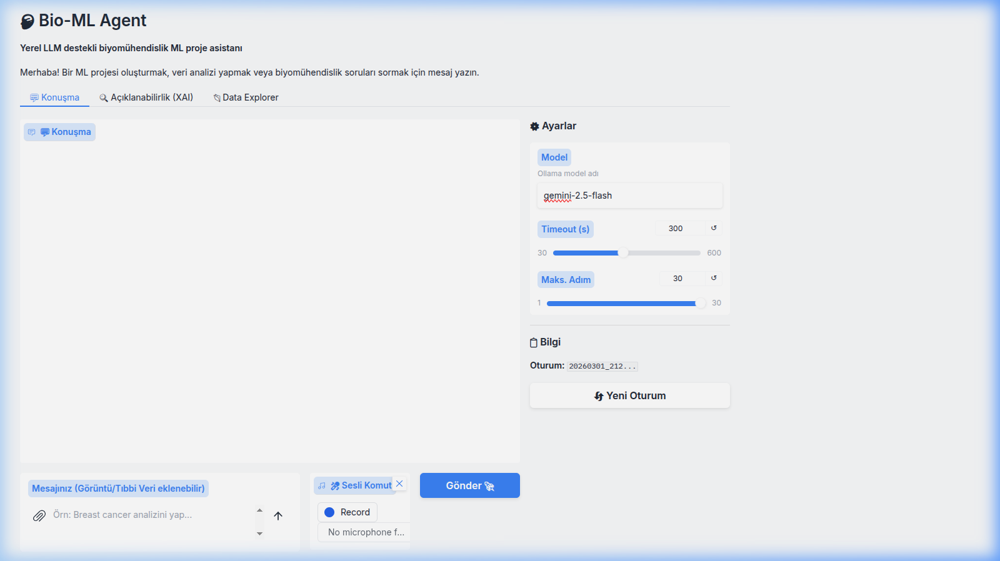

<div align="center">

# 🧠 Bio-ML Agent

**Modular AI assistant for bioengineering and ML workflows**

[](https://www.python.org/downloads/)
[](LICENSE)
[](#desteklenen-llm-backendleri)
[](#-docker-ile-çalıştırma)



</div>

---

## 🎯 Ne Yapar?

Doğal dil komutuyla **3 uzman ajan** koordineli çalışarak komple ML projesi oluşturur:

```
>>> Buradaki data/raw/diabetes.csv verisini oku, temizle, model kur ve SHAP analizi yap.
```

**→ Veri Mühendisi** temizler → **ML Uzmanı** eğitir + SHAP üretir → **Biyoinformatik Uzman** klinik yorumlar

---

## ⚡ Hızlı Başlangıç

```bash
git clone https://github.com/zedraxa/bio-ml-agent_v0.2.git && cd bio-ml-agent_v0.2
python3 -m venv venv && source venv/bin/activate
pip install -e ".[all]"

export GEMINI_API_KEY="YOUR_KEY"
python3 web_ui.py     # → http://localhost:7860
```

**Docker:**
```bash
docker-compose up -d  # API :8001 | Web :7860 | MLflow :5005
```

---

## 🏗️ Mimari


---

## 🛠️ 5 Ana Özellik

### 1. 🧩 Çoklu Ajan (Swarm)
Orchestrator → Data Engineer → ML Expert (+ XAI) → Bioinfo Expert

### 2. 🔍 Açıklanabilir AI (XAI)
SHAP/LIME grafikleri otomatik üretilir, Gradio'da ayrı sekmede görüntülenir

### 3. 🔄 Sürekli Öğrenme (Active Learning)
Redis Streams'ten sensör verisi → Otonom retrain → MLflow'da model karşılaştırma

### 4. 🐳 Kurumsal Altyapı
Docker Compose (5 servis) + Redis Queue + Webhook + MLflow Tracking

### 5. 🧬 Biyomühendislik Toolkit
Protein analizi · Genomik · İlaç molekülü (Lipinski) · Atık su kalitesi

---

## 🤖 Desteklenen LLM Backend'leri

| Backend | Komut |
|---------|-------|
| **Google Gemini** | `--model gemini-2.5-flash` |
| **Ollama** (Yerel) | `--model qwen2.5:7b-instruct --backend local` |
| **OpenAI** | `--model gpt-4o --backend remote` |
| **Anthropic** | `--model claude-3-5-sonnet --backend remote` |

---

## 📁 Proje Yapısı

```
bio-ml-agent/
├── agent.py                 # Ana agent motor
├── web_ui.py                # Gradio Web UI
├── api_server.py            # FastAPI REST + Webhook
├── docker-compose.yml       # 5 Mikroservis
├── swarm/                   # Çoklu Ajan
│   ├── orchestrator.py
│   ├── data_engineer.py
│   ├── ml_expert.py
│   ├── bioinfo_expert.py
│   └── active_learning_worker.py
├── data_streams/            # DB + Redis Streams
├── utils/                   # Model karşılaştırma, config, görselleştirme
├── tests/                   # Test suite
└── workspace/               # Agent çıktıları
```

---

## 🧪 Testler

```bash
python -m pytest tests/ -x -q
```

---

## 📄 Dokümantasyon

| Dosya | İçerik |
|-------|--------|
| [Kullanma Kılavuzu](KULLANMA_KILAVUZU.md) | Detaylı kullanım rehberi |
| [Proje Raporu](RAPOR.md) | Kapsamlı teknik rapor |
| [Geliştirme Planı](GELISTIRME_PLANI.md) | Sprint bazlı yol haritası |
| [Katkı Rehberi](CONTRIBUTING.md) | Geliştirici katılım kılavuzu |

---

## ⚠️ Güvenlik

> **Uyarı:** Plugin sistemi yerel Python kodu çalıştırır. Güvenilmeyen plugin'leri yüklemeyin.
> Bash komutları denylist ile filtrelenir, path traversal koruması aktiftir.

---

## 👤 Geliştirici

**Yusuf Kavak** — [@zedraxa](https://github.com/zedraxa)

---

<div align="center">

**⭐ Bu projeyi beğendiyseniz yıldız vermeyi unutmayın!**

</div>
